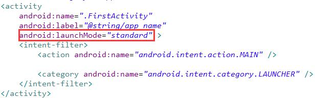
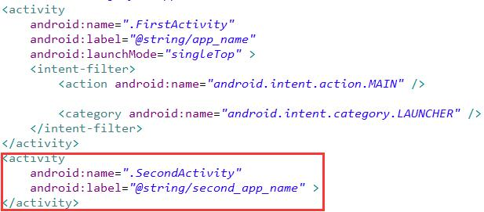
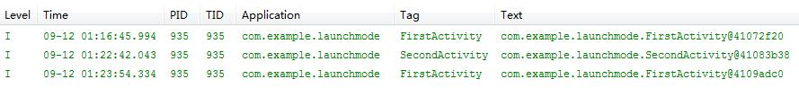

Activity有4种启动模式：standard、singleTop、singleTask、singleInstance

# standard
> 标准模式，默认，每次都会启动一个新的活动实例

* 新建FirstActivity  

 

* 注册FirstActivity 

 

* 启动程序，连点两次按钮，可以看到日志中打印如下日志 

 

* 由于此时返回栈中存在3个实例，所以点击Back键三次才能退出程序。 

# singleTop
> 栈顶复用模式，首先判断栈顶Activity是否是要启动的Activity，如果是则直接引用这个Activity；如果不是则创建新的Activity。

## 测试同一Activity内跳转

1) 延用上一示例，将AndroidManifest中FirstActivity的启动模式改为singleTop  

 

2) 此时会发现，无论点击多少次按钮，都只会存在一个实例。 

 

3) 由于返回栈中只存在一个实例，所以退出程序时，只需要点击Back键一次。   

## 测试不同Activity间跳转

1) 新建SecondActivity  

 

2) 将其注册为普通活动。 

 

3) 修改上一示例中的FirstActivity，新增按钮singleTop，当点击时，使其由FirstActivity跳转到SecondActivity。 

 

4) 启动程序，会先创建一个FirstActivity的实例 

 

5) 点击singleTop，会跳转到SecondActivity  

 

6) 点击SecondActivity中的返回按键，再次跳转到FirstActivity。由于此时返回栈的栈顶是SecondActivity，所以系统会再次创建一个FirstActivity的实例  

 

7) 当点击Back键退出时，会先从FirstActivity退到SecondActivity，再从SecondActivity退至FirstActivity，最后再次点击Back时才会退出程序。 

# singleTask
> 栈内复用模式，检测整个Activity栈中是否存在当前需要启动的Activity，如果存在则将该Activity置于栈顶，并销毁其上所有Activity。

1) 同样，延用上一示例，将AndroidManifest中FirstActivity的启动模式改为singleTask 

 

2) 在FirstActivity中新增按钮singleTask，当点击时，使其由FirstActivity跳转到SecondActivity。 

 

3) 重写FirstActivity的onRestart方法。 

 
重写SecondActivity的onDestroy方法。 

 

4) 启动程序，会先创建一个FirstActivity的实例 

 

5) 点击singleTask，会创建SecondActivity实例，并跳转到SecondActivity  

 

6) 此时，返回栈中已经存在一个FirstActivity实例，且该实例在SecondActivity下面。当从SecondActivity中启动FirstActivity时，SecondActivity会先出栈，而FirstActivity将重新成为栈顶活动。因此FirstActivity的onRestart()和SecondActivity的onDestroy()都会被执行。 

 

7) 现在返回栈中只有FirstActivity一个实例，按下Back键将会直接退出程序。 