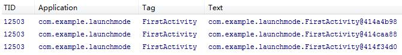
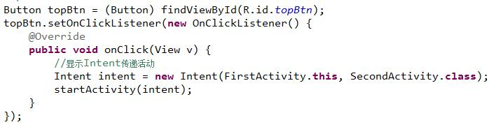
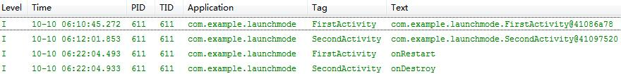
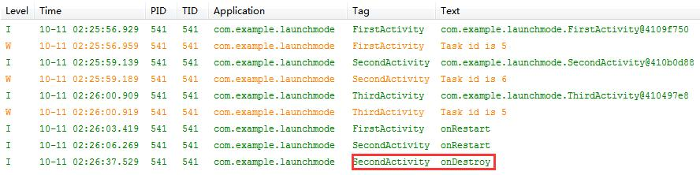

Activity有4种启动模式：standard、singleTop、singleTask、singleInstance

# standard
> 标准模式，默认，每次都会启动一个新的活动实例

1) 新建FirstActivity  

 

2) 注册FirstActivity 

 

3) 启动程序，连点两次按钮，可以看到日志中打印如下日志 

 

4) 由于此时返回栈中存在3个实例，所以点击Back键三次才能退出程序。 

# singleTop
> 栈顶复用模式，首先判断栈顶Activity是否是要启动的Activity，如果是则直接引用这个Activity；如果不是则创建新的Activity。

## 测试同一Activity内跳转

1) 延用上一示例，将AndroidManifest中FirstActivity的启动模式改为singleTop  

 

2) 此时会发现，无论点击多少次按钮，都只会存在一个实例。 

 

3) 由于返回栈中只存在一个实例，所以退出程序时，只需要点击Back键一次。   

## 测试不同Activity间跳转

1) 新建SecondActivity  

 

2) 将其注册为普通活动。 

 

3) 修改上一示例中的FirstActivity，新增按钮singleTop，当点击时，使其由FirstActivity跳转到SecondActivity。 

 

4) 启动程序，会先创建一个FirstActivity的实例 

 

5) 点击singleTop，会跳转到SecondActivity  

 

6) 点击SecondActivity中的返回按键，再次跳转到FirstActivity。由于此时返回栈的栈顶是SecondActivity，所以系统会再次创建一个FirstActivity的实例  

 

7) 当点击Back键退出时，会先从FirstActivity退到SecondActivity，再从SecondActivity退至FirstActivity，最后再次点击Back时才会退出程序。 

# singleTask
> 栈内复用模式，检测整个Activity栈中是否存在当前需要启动的Activity，如果存在则将该Activity置于栈顶，并销毁其上所有Activity。

1) 同样，延用上一示例，将AndroidManifest中FirstActivity的启动模式改为singleTask 

 

2) 在FirstActivity中新增按钮singleTask，当点击时，使其由FirstActivity跳转到SecondActivity。 

 

3) 重写FirstActivity的onRestart方法。 

 
重写SecondActivity的onDestroy方法。 

 

4) 启动程序，会先创建一个FirstActivity的实例 

 

5) 点击singleTask，会创建SecondActivity实例，并跳转到SecondActivity  

 

6) 此时，返回栈中已经存在一个FirstActivity实例，且该实例在SecondActivity下面。当从SecondActivity中启动FirstActivity时，SecondActivity会先出栈，而FirstActivity将重新成为栈顶活动。因此FirstActivity的onRestart()和SecondActivity的onDestroy()都会被执行。 

 

7) 现在返回栈中只有FirstActivity一个实例，按下Back键将会直接退出程序。 

# singleInstance
> 单实例模式。指定为singleInstance模式的Activity会创建新的任务栈，且该任务栈仅有一个Activity。

1) 延用以上示例，新增活动ThirdActivity，在onCreate()中打印当前返回栈ID 

 

2) 将AndroidManifest中SecondActivity的启动模式改为singleInstance，并注册ThirdActivity为普通活动 

 

3) 在FirstActivity中打印当前返回栈ID 
 
并新增按钮singleInstance，当点击时，使其由FirstActivity跳转到SecondActivity。 

 

4) 在SecondActivity中打印当前返回栈ID，并新增按钮"转向ThirdActivity"，点击此按钮可跳转至ThirdActivity 
 

5) 启动程序，会先创建一个FirstActivity的实例，并输出FirstActivity的TaskId 

 

6) 点击FirstActivity上的instanceTask按键，跳转到SecondActivity。可以发现，SecondActivity的TaskId与FirstActivity的TaskId不同。 

 

7) 点击SecondActivity上的"转向ThirdActivity"，跳转到ThirdActivity。此时，你会发现，FirstActivity和ThirdActivity的TaskId相同，而SecondActivity的TaskId不同。这是由于SecondActivity活动模式为singleInstance，这导致系统启动了一个新的返回栈来管理该活动。 

 

8) 点击Back按键返回，由于此时活动栈中只有ThirdActivity、FirstActivity，所以ThirdActivity出栈，FristActivity进入栈顶。 

 

9) 再次点击Back按键，FirstActivity出栈，进入SecondActivity。 

 

10) 再次点击Back按键，SecondActivity出栈，程序退出。 

 
