# android-example

## [Activity](http://luoml.coding.me/2016/08/31/android-activity/ "Activity")
### 1. ActivityLifeCycle
演示Activity生命周期。
参考
[《第一行代码》](http://blog.csdn.net/guolin_blog/article/details/26365913 "郭神's blog")第2章
 

本示例主要分为三个Activity：MainActivity（主活动，程序入口）、NormalActivity（普通活动）、DialogActivity（对话框式活动）。 

MainActivity包含两个按钮，点击按钮分别跳转至NormalActivity、DialogActivity，如下： 
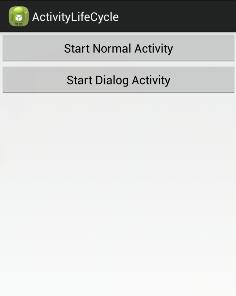

 
当首次启动，进入MainActivity主界面时，会依次执行MainActivity的onCreate() -> onStart() -> onResume()，日志如下： 
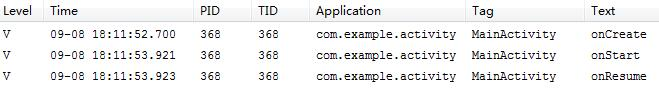
 

此时，当点击Start Normal Activity时，将进入NormalActivity： 

 
由于NormalActivity将MainActivity完全遮挡住，因此onPause() -> onStop()都会执行，如下： 
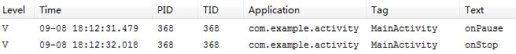
 

当从NormalActivity点击Back按键返回时，由于之前的MainActivity已进入停止状态，所以会依次执行onRestart() -> onStart() -> onResume()，如下： 
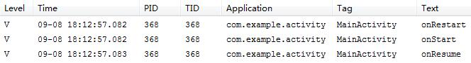
 

然后，点击Start Dialog Activity时，启动DialogActivity： 
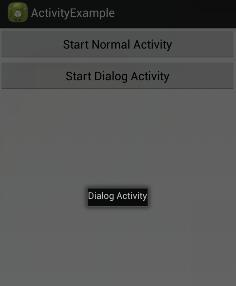
 
由于DialogActivity并没有完全遮住MainActivity，此时MainActivity只是进入暂停状态，所以只执行了onPause()： 
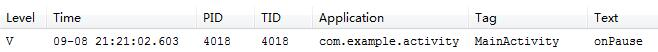
 

当由DialogActivity点击Back按键返回MainActivity主界面时，相应地也只会执行onResume()： 
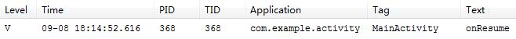
 

最后，在MainActivity按下Back退回程序时，会依次执行onPause() -> onStop() -> onDestroy()，如下： 
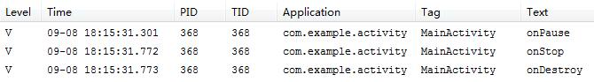
 

### 2. ActivityLaunchMode
演示Activity启动模式。
 

Activity有4种启动模式：standard、singleTop、singleTask、singleInstance

#### standard
> 标准模式，默认，每次都会启动一个新的活动实例

1. 新建FirstActivity 
 
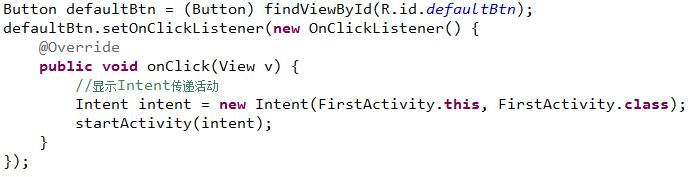

2. 注册FirstActivity
 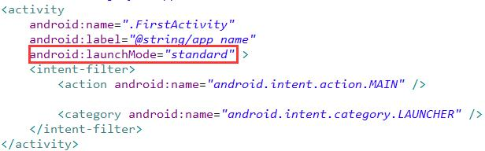
3. 启动程序，连点两次按钮，可以看到日志中打印如下日志 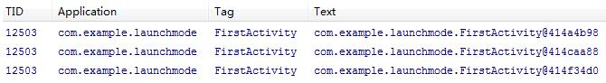
4. 由于此时返回栈中存在3个实例，所以点击Back键三次才能退出程序。 

#### singleTop
> 栈顶复用模式，首先判断栈顶Activity是否是要启动的Activity，如果是则直接引用这个Activity；如果不是则创建新的Activity。

1. 测试同一Activity内跳转
 
仍延用上一示例，将AndroidManifest中FirstActivity的启动模式改为singleTop  
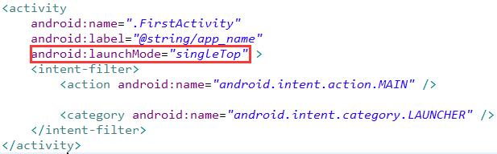  
此时会发现，无论点击多少次按钮，都只会存在一个实例。 
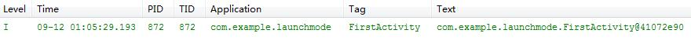  
由于返回栈中只存在一个实例，所以退出程序时，只需要点击Back键一次。   

2. 测试不同Activity间跳转
 
新建SecondActivity 
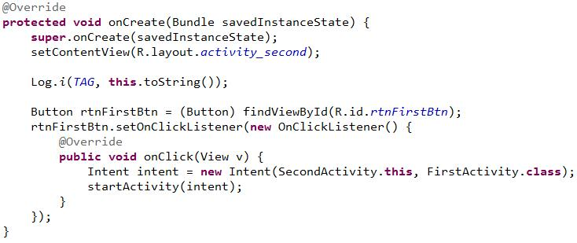  
将其注册为普通活动。 
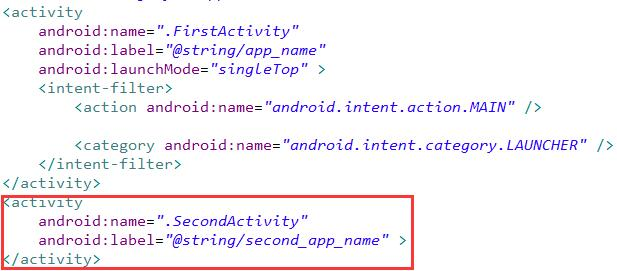 
修改上一示例中的FirstActivity，新增按钮singleTop，当点击时，使其由FirstActivity跳转到SecondActivity。 
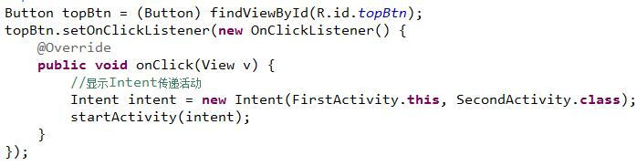 
启动程序，会先创建一个FirstActivity的实例 
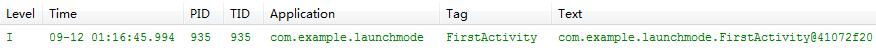  
点击singleTop，会跳转到SecondActivity  
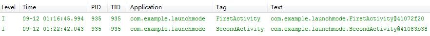  
点击SecondActivity中的返回按键，再次跳转到FirstActivity。由于此时返回栈的栈顶是SecondActivity，所以系统会再次创建一个FirstActivity的实例  
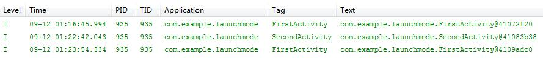  
当点击Back键退出时，会先从FirstActivity退到SecondActivity，再从SecondActivity退至FirstActivity，最后再次点击Back时才会退出程序。
